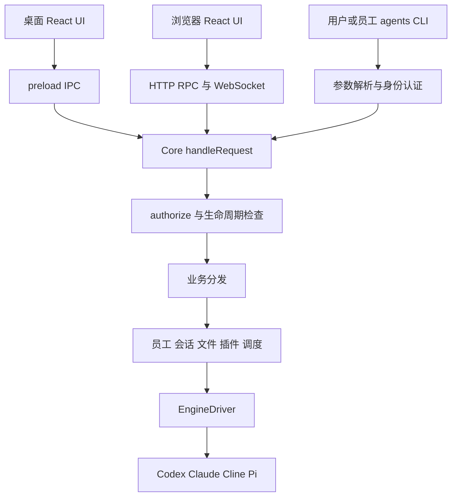

# Aexus 源码架构教程

这份教程围绕一次完整的使用过程展开：创建员工，为它确定身份和工作环境，发送任务，驱动 Coding Agent，把结果显示出来，再检查它能否管理其他员工。沿着这个过程，你提出的引擎封装、UI 与 CLI、初始化、权限、性能和崩溃风险就能连起来理解。

最重要的结论是：**Aexus 的中心是公司 Core。UI、公司 CLI 和员工调用都是它的入口；Codex、Claude、Cline、Pi 是它调用的执行引擎。** 公司身份、职位、任务和工作区由 Core 管理，引擎负责模型推理及其工具执行。

本文基于 **2026 年 9 月 30 日当前工作区源码**，包含尚未提交的修改；不能只用当前 Git 提交号代表这些实现，也不代表已安装 App 一定与这份源码一致。文中的“支持”指本项目适配器实际接入的能力。静态分析、已运行测试和改进建议分别注明。

## 一 先区分公司对象和执行引擎

从界面看，项目是一间可以安排团队和员工的办公室。从代码看，需要先认清下面这些对象。

| 对象 | 它解决的问题 | 主要位置 |
| --- | --- | --- |
| Team | 员工属于哪个团队，使用哪类工作区和主机 | `Store.groups`、`teamSettings`、`teamRoots` |
| Employee 记录 | 这个员工是谁，叫什么，用什么引擎，有什么职位 | `StoredSession`；公司 API 中主要叫 `card.*` |
| 运行中的会话 | 这个员工当前是否连接引擎、是否忙、有哪些排队消息 | `sessions.ts` 中的 `live`、`Live`、`SessionInfo` |
| 原生引擎会话 | 怎样恢复 Codex thread、Claude session、Cline session 或 Pi session | 员工的原生会话字段和 `nativeSessions` |
| 公司会话镜像 | 公司 UI、CLI、管理者怎样读取一致的聊天历史 | `transcripts.ts`、`Session.items` |
| Team View 和相机 | 用户当前看哪些团队、看哪个区域 | `team-views.ts`、`presentation.ts`、`client-state.ts` |

源码沿用了早期命名，因此 `StoredSession` 实际承担了持久员工卡片的职责。不要看到 `session` 就认为全部是同一种会话。

尤其要分清三个 ID：**员工 ID** 用来长期寻址；**公司运行会话 ID** 指向本次打开的连接；**原生会话 ID** 用来恢复引擎历史。它们有时看起来相似，但不能互相替代。管理任务通常优先写 `--employee EMPLOYEE_ID`，由 Core 寻找或打开当前连接。

一个员工还有几组独立属性：

| 属性 | 例子 | 决定什么 |
| --- | --- | --- |
| `engine` | `codex`、`claude`、`cline`、`pi` | 使用哪个执行引擎，创建后固定 |
| `model` | 某个 Codex 模型或 `deepseek-flash` | 这个引擎调用哪个模型 |
| `managementRole` | `employee`、`manager`、`governor` | 可以调用哪些公司管理 API |
| `kind` | `worker`、`cloud-native-worker` | 引擎进程在 Core 主机还是远端主机运行 |
| `workEnvironment` | `team`、`local` | 继承 Team 的工作环境，还是使用 Core 本地工作区 |
| `permissionMode` | Ask 对应的 `default`、`acceptEdits` 等 | 引擎工具怎样请求审批、执行操作 |
| `accessMode` | `trusted`、`isolated` | 有没有项目提供的外层进程隔离 |

例如，一个 Claude Manager 可以属于 Ubuntu Cloud Team，但它自身的进程和管理工作区在 Core 主机，设置为 `worker + local`；它管理的 Pi Employee 可以是 `worker + team`，Pi 进程在 Core 主机，文件和命令通过 Tunnel 到 Ubuntu。**加入云团队，不等于引擎进程一定在云端。**

Team 的三种工作区是 Build、Work、Cloud：Build 对应本地项目目录；Work 对应插件工作区；Cloud 绑定远端主机和目录。“本地”始终相对于 Core，不能把浏览器电脑的路径当成服务器路径。

源码入口：[类型定义](../src/shared/types.ts)、[职位定义](../src/shared/roles.ts)、[会话管理](../src/main/sessions.ts)、[工作区解析](../src/main/workspaces.ts)。

## 二 UI 和 CLI 怎样进入同一个 Core

本项目同时出现两种 CLI，必须先区分：

- **公司 CLI `agents`**：创建团队、创建员工、派发任务、读历史、管理调度等。
- **引擎 CLI `codex`、`claude`、`cline`、`pi`**：启动某个 Coding Agent 的运行时。

UI 调用公司的业务功能时，通常不执行 `agents ...` shell 命令。实际结构如下。



CLI 的工作主要是把终端参数变成结构化请求。例如：

```sh
agents session send --employee EMPLOYEE_ID --text "检查项目测试并报告结果" --json
```

对应的业务请求可简化为：

```json
{
  "cmd": "session.send",
  "args": {
    "employee": "EMPLOYEE_ID",
    "text": "检查项目测试并报告结果"
  }
}
```

本地 socket 传输还会附加凭据。UI 则直接调用 `api.call('session.send', args)`，不需要先经过 shell 参数解析。

### 桌面 浏览器和终端的具体路径

桌面路径是 `App.tsx → api.ts → preload/index.ts → ipcMain → handleRequest`。Electron 主进程先确认调用来自受信任的主窗口，再创建 operator 身份上下文。Core 可以直接运行在 Electron 主进程里，**不意味着一定另有一个独立的 Core 操作系统进程**。

无窗口运行时，`agents serve` 启动 Node daemon，由同一个 `startRuntime()` 装配 Core。macOS/Linux 本地 CLI 使用私有 Unix socket，Windows 使用按数据目录区分的 named pipe。

浏览器路径是 `web/transport.ts → POST /api/rpc → handleRequest`；事件通过 `/api/events` WebSocket 返回。浏览器登录、Cookie、CSRF、Origin 和客户端身份由 Web 边界处理。远程公司 CLI 还可以通过 HTTP 客户端访问同一服务。

因此，Core 会知道**调用身份和必要的客户端上下文**，但权限不是通过一个用户可伪造的 `source: UI` 字段决定的。`RequestContext` 的核心是 `principal`、`requestId`，并可附带 `credentialHash`、`clientId`。用户在 UI 和用户 CLI 发同一个业务请求，通常都属于 operator；员工即使知道同一个命令名，也使用自己的 agent 身份。

来源信息仍有具体用途：例如不同浏览器拥有独立相机和面板状态；桌面“已读确认”还检查真实窗口是否可见且获得焦点。这些是呈现语义，不是让 UI 绕过公司授权。

### 这带来什么好处

业务规则只有一份，界面按钮和脚本不会分别实现员工创建、权限检查或目录处理。没有窗口也可以自动化、调度和测试；更换 Electron 为浏览器，不必重写员工管理。Agent 也能使用稳定的结构化接口，而不需要模拟鼠标点办公室。

但要理解范围：`ui.screenshot`、`ui.click` 等呈现命令需要对应的界面能力；“业务可以无界面运行”不表示无窗口环境也能截图。按钮展开、输入草稿和视觉效果也不必全变成业务命令。

源码入口：[公司 CLI](../bin/agents)、[传输协议](../src/shared/protocol.ts)、[Core 请求入口](../src/main/server.ts)、[桌面边界](../src/main/index.ts)、[Web 边界](../src/main/web/server.ts)、[请求身份上下文](../src/main/request-context.ts)。

## 三 四个 Coding Agent 实际怎样封装

回答“是否都以 CLI 为基石”：**它们都依赖原生 Coding Agent 运行时，但项目接入的是结构化协议或 SDK，不是在读取交互式终端屏幕。Claude 还多了一层官方 Agent SDK 控制库。**

| 项目引擎 ID | 当前接入入口 | 适配器做什么 |
| --- | --- | --- |
| `codex` | Codex CLI 的 `app-server`，结构化请求和事件 | 启动或恢复 thread，发起 turn，处理增量、审批、停止、追加及原生控制 |
| `claude` | Claude Agent SDK 的 `query()`，配套原生运行时 | 使用异步输入流、消费 SDK 消息，通过 SDK 设置模型、权限、思考及停止任务 |
| `cline` | `cline --acp --auto-approve false` | 处理 ACP `initialize`、`session/new/load/prompt`、更新事件和权限请求 |
| `pi` | `pi --mode rpc` | 处理 JSONL RPC、prompt、steer、abort、工具事件及公司审批扩展 |

这里的“翻译器”是 `Infra/src/main/engines/` 中的一组模块。项目没有为了统一聊天显示，再额外设立一个专门的“翻译进程”。真正存在的进程边界主要是 Core、UI renderer、外部引擎及必要的 SSH/Tunnel 辅助进程。

### 统一的是哪些接口

`contract.ts` 中的 `EngineDriver` 给 Core 一组共同操作：

```ts
send(text, images)
steer(text)
interrupt()
close()
whenIdle()
setModel(model)
setPlan(enabled)
setPermission(mode)
setThinking(enabled)
setEffort(effort)
setFast(enabled)
background(processId, stop)
```

`runtime.ts` 的注册表把四个 engine ID 分别映射到 `openCodex`、`openClaude`、`openCline`、`openPi`。`sessions.ts` 负责会话、排队、任务来源和生命周期，再把具体操作交给 driver。

接口存在不表示每个引擎实现全部能力。比如 Pi 的 `setPlan()` 明确拒绝，Cline 的 `steer()` 明确拒绝；UI 也应根据能力隐藏或禁用对应入口。这个“统一接口加明确不支持”的设计，比悄悄改用另一个引擎更容易理解和维护。

适配器也不只是改字段名。它必须处理进程启动、协议握手、恢复原生会话、取消、错误、审批、模型设置、云端工具边界和资源清理。公司授权仍留在 Core。

### 几个容易误判的当前限制

1. **员工的 engine 创建后固定。** 换模型不是换引擎；`card.update` 拒绝改 engine，旧 `config.engine` 也拒绝。要用另一引擎，需要明确删除并重新创建员工。
2. **当前 Cline/Pi 适配器围绕 DeepSeek 接入。** 默认 `deepseek-flash`，Thinking off；不能据此声称这两个原生产品只支持 DeepSeek 或没有思考能力。
3. **当前 Cline/Pi 支持 Core 本地 Build，以及通过 Tunnel 工作的 Cloud Team。** 不支持 Work 插件目录或 `cloud-native-worker`，创建和执行均检查。
4. **公司员工不等于原生 subagent。** 创建员工必须进入公司 `card.create` 等管理流程。Codex 运行参数禁用原生 multi-agent；公司管理也不依赖某个引擎内置的子 Agent 协议。
5. **Cline 图片存在专用兼容层。** 当前适配器为目标版本的 ACP 图片丢失问题建立员工私有 loopback relay，将已审批的图片加入原生模型请求；保持原来的响应流，不额外发起一轮推理。这是协议兼容，不是前端图片预览功能。

源码入口：[引擎合同](../src/main/engines/contract.ts)、[运行时注册](../src/main/engines/runtime.ts)、[能力声明](../src/shared/engines.ts)、[Codex](../src/main/engines/codex-runtime.ts)、[Claude](../src/main/engines/claude-runtime.ts)、[Cline](../src/main/engines/cline-runtime.ts)、[Pi](../src/main/engines/pi-runtime.ts)。补充说明见 [ENGINE_ADAPTERS](ENGINE_ADAPTERS.md)。

## 四 从原生输出到同一个聊天窗口

回答“是否有统一的数据结构”：**有。最终面向公司的会话结构已经统一；输入事件还保留三条兼容路径。**

当前事件路径是：

```text
Claude SDK 消息 ── session:message ── recordClaude / apply
Codex 映射事件 ── session:codex ──── recordCodex / applyCodex
Cline 和 Pi ──── session:agent ──── recordAgent / applyAgent
                                            │
                                            ▼
                              Core 中的 Session.items
                                  │                │
                                  ▼                ▼
                             会话快照与 UI     CLI 历史与导出
```

`applyCodex` 当前直接复用 `applyAgent`。Claude 则保留针对 SDK 消息的 reducer。Reducer 可以理解为“收到一个新事件后，计算新的会话状态的函数”。

最终数据模型的核心很小：

```ts
type Item =
  | { role: 'user'; id: string; text: string; images?: string[] }
  | { role: 'assistant'; id: string; blocks: Block[] }
  | { role: 'notice'; id: string; text: string; tone: 'info' | 'error' }

type Block =
  | { kind: 'text'; text: string; id?: string }
  | { kind: 'thinking'; text: string; done: boolean; id?: string }
  | { kind: 'tool'; id: string; name: string; input: unknown;
      result?: string; running: boolean; isError?: boolean; elapsed?: number }
```

上面为便于阅读把工具输入写成 `unknown`；当前源码实际使用 `any`。不同引擎的文字、可见思考摘要、工具输入和工具结果，最终都能放进这套结构。

`Chat.tsx` 的 `Turn`、`BlockView`、`ToolCall` 按 `role` 和 `kind` 渲染，所以并没有四套独立聊天窗口。原生消息编号和工具调用编号用于合并增量与最终结果，避免把一次输出显示两遍。

### 当前 UI 更新有一个值得特别记住的细节

源码注释中仍有“GUI 和 Core 使用同一 reducer”的历史描述。但当前 `App.tsx` 的主路径是：

1. Core 收到引擎事件，更新内存中的会话镜像。
2. Core 发布变化通知。
3. UI 将通知在约 **35 毫秒**窗口内合并，读取运行会话摘要。
4. 当变化涉及正在查看的会话时，再读取该会话的 `session.snapshot`。
5. UI 用 `retainEqual()` 复用未变化对象，再交给 React。

Web 会把聊天事件缩成会话 ID 通知，桌面仍会转发较完整的事件载荷；二者的 `App.tsx` 都以刷新快照为主。这里不是“每个前端都直接消费原生事件增量并自行维护整份历史”。阅读当前源码时，应以实际调用链为准。

这解释了 UI 与 CLI 为什么能看到同一历史：**权威会话镜像在 Core，即使从未打开聊天窗口，Core 仍然记录会话。**

此外，公司可见历史和引擎上下文是两份有联系但不同的数据。引擎的隐藏初始化轮可以保留在原生上下文中，却不进入公司可见历史；只看 UI 导出的文本不能还原所有原生内部状态。

源码入口：[统一 Item 和 Block](../src/shared/types.ts)、[事件合并函数](../src/shared/transcript.ts)、[Core 历史镜像](../src/main/transcripts.ts)、[事件汇总](../src/main/runtime.ts)、[实际 UI 刷新](../src/renderer/src/App.tsx)、[快照复用](../src/renderer/src/snapshot.ts)、[聊天组件](../src/renderer/src/chat/Chat.tsx)。

## 五 通用 UI 能统一到什么程度

你的方向可以实现，而且项目已经做了相当一部分：发送、停止、排队、聊天展示、审批卡片、文件、终端和调度可以共用组件与公司 API。引擎差异集中在适配器中，UI 按能力展示。

但模型参数、计划模式、追加消息等存在真实语义差异。要达到统一体验，应该统一**用户意图和组件形式**，同时让 Core 明确报告当前可执行的能力。

一个按钮能否使用，需要同时满足：

```text
调用者有权限
且适配器支持
且当前模型及工作环境支持
且当前会话状态允许
```

例如，共用“追加”按钮没问题，但 Cline 当前不支持 steering；共用“添加图片”入口也没问题，但当前 Pi 不支持图片，而 Cline 的图片还取决于选中的模型。把按钮全部强行启用，只会把差异转化为执行失败。

### 当前能力对照

下表描述本项目适配器，不是四个原生产品的完整功能清单。

| 能力 | Codex | Claude Agent | Cline | Pi |
| --- | --- | --- | --- | --- |
| 文本流和原生恢复 | 支持 | 支持 | 支持 | 支持 |
| 公司排队和调度 | 支持 | 支持 | 支持 | 支持 |
| 审批接入 | 原生请求映射 | SDK 回调 | ACP 权限请求 | 公司扩展桥接 |
| 运行中追加 | 支持 | 支持 | 不支持，使用排队 | 支持 |
| 计划模式 | 支持 | 支持 | 支持 Plan/Act | 不支持 |
| 思考开关 | 使用 effort 等原生能力 | 支持，取决于模型配置 | 当前固定 off | 当前固定 off |
| 思考强度 | 模型支持时可设 | 模型支持时可设 | 当前不支持 | 当前不支持 |
| 图片输入 | 取决于模型 | 取决于模型 | 当前 Flash 支持，V4 Pro 不支持 | 当前不支持 |
| 克隆原生上下文 | 支持但受环境限制 | 支持但受环境限制 | 不支持 | 不支持 |
| 原生后台任务控制 | 支持 | 支持 | 未接入 | 未接入 |
| Cloud Native Worker | 支持 | 支持但有部分能力限制 | 不支持 | 不支持 |
| Work 插件工作区 | 支持 | 支持 | 不支持 | 不支持 |

“克隆支持”不能进一步理解成所有组合都支持：严格隔离下的原生历史克隆、云端 Claude 克隆等有明确限制，见 [引擎能力说明](../ENGINE_CAPABILITIES.md)。

### 特殊功能放在哪里更合适

**建议保留一个通用会话区，再用已有“工具与额度”区域承载引擎专属内容。** 常用、语义稳定的开关继续放在通用栏；低频原生能力放在同一扩展区域。不需要再做四个完整页面。

| 引擎 | 已有可用入口或数据 | 适合的统一或专属呈现 |
| --- | --- | --- |
| Codex | `/review`、`/compact`、skills、账号额度、原生后台终端；支持的模型有 Fast 档位 | 审查、上下文压缩、额度明细、后台进程列表；云端本地引擎还有“远端主机管理”开关 |
| Claude | 独立 Thinking 开关，SDK 动态命令、MCP 状态、`/usage`、后台任务 | 通用栏显示 Thinking；扩展区显示原生命令、MCP 和用量；审批区展示 AskUserQuestion 或 elicitation |
| Cline | Plan/Act、ACP 审批、固定 Thinking off，Cloud Tunnel 配置信息 | 通用计划开关映射为 Plan/Act；扩展区解释当前 ACP 能力与 Tunnel 状态；不显示不可用的追加、克隆、后台进程控制 |
| Pi | RPC steering、扩展桥接的工具审批、用量信息，固定 Thinking off | 共用追加和审批按钮；扩展区显示 RPC 适配能力、用量与 Tunnel 信息；不显示计划、克隆和图片功能 |

**当前没有接入的功能要标成建议。** 比如完整 Pi 扩展交互面板、Cline 的所有原生检查点操作，不能只因为原生产品可能有，就当作公司 UI 已支持。`pi-client.ts` 当前只处理指定的公司审批和 Tunnel 请求，对其他交互请求可能直接取消。

目前能力判断也还没有完全收敛：`ENGINE_DEFINITIONS` 已集中声明能力，但 `App.tsx`、`engine-tools.ts` 等仍有部分 `engine === ...` 分支。后续可以逐步把这些入口整理为能力驱动；先复用现有 `engine.capabilities`、`engine.inspect` 和 `view.tools`，无需另造一套插件框架。

专属 UI 的执行路径仍应该是“UI → 公司 Core 命令 → 授权 → 适配器”。不能给扩展区一个任意原生 RPC 通道，绕过现有授权和状态检查。

源码入口：[能力定义](../src/shared/engines.ts)、[斜杠命令](../src/shared/engine-commands.ts)、[引擎检查面板数据](../src/main/engine-tools.ts)、[会话控制栏](../src/renderer/src/App.tsx)。

## 六 创建员工时到底初始化了什么

“初始化”在项目里至少有两层含义：**准备应用对象和工具环境**，以及**让模型执行一轮隐藏的阅读任务**。普通 Employee 只跳过第二层。

### 创建时所有职位都需要的准备

`card.create` 先检查调用者是否能创建这个职位和目标团队，然后核对引擎、执行位置、工作环境和目录。它分配员工 ID，记录真实创建者，生成所需手册和 launcher，保存员工记录。引擎进程启动时再绑定该员工凭据、原生配置目录和运行环境。

因此，Employee 并不是“项目完全不初始化它”。它仍有身份、状态、目录、会话恢复和公司 API 边界。Work Employee 还需要插件 CLI 和插件文档；只是普通 Build Employee 尽量保持原生提示上下文干净。

### 哪些职位会执行隐藏模型轮

| 职位 | 新建状态 | 是否执行隐藏模型轮 | 注入内容 |
| --- | --- | --- | --- |
| Employee | 直接 `ready` | 否 | Build 无公司管理引导；Work 有简短插件工具发现说明 |
| Manager | `pending → running → ready` 或 `failed` | 是 | 本 Team 管理范围、身份入口、角色 API 与权限手册 |
| Governor | `pending → running → ready` 或 `failed` | 是 | 全局管理范围、Governor 生命周期限制及相关手册 |

隐藏初始化由 `initialization.ts` 的队列执行，当前并发为 **2**，单次超时为 **180 秒**。模型被要求只读指定文档，不执行示例、不发任务、不写文件、不申请权限，最终返回 `OK`。

`runPrivateInitialization()` 在事件进入公共历史和广播前截获初始化输出。成功后原生上下文仍然保留阅读结果，但用户聊天历史、未读回复和普通任务不显示这轮内容。失败保留 `failed`，可以通过 `card.initialize` 重试。初始化未就绪前，普通工作请求会被 Core 拒绝。

这里有一个精度边界：收到 `OK` 是应用层的完成判据，**不是形式化证明模型已经逐字阅读并永远记住手册**。即使模型误解或忘记规则，Core 仍然独立检查每一次 API 调用。

### 隐藏目录是路由还是完整文档

实际名称是小写 `.agents-company/`，它是一个目录。当前本地工作区大致如下：

```text
员工工作区/
└── .agents-company/
    ├── Infra/src/cli/agents                 身份绑定的公司 CLI 入口
    ├── AGENTS.md                  共享引导说明
    ├── CLAUDE.md                  共享引导说明
    ├── API.md                     中性入口，指向当前员工手册
    ├── employees/<employeeId>/
    │   ├── AGENTS.md              当前员工的角色说明
    │   ├── CLAUDE.md              对应的角色说明
    │   ├── API.md                 按身份生成的 API 手册
    │   ├── PERMISSIONS.md         按身份生成的权限说明
    │   └── bootstrap.json         文档准备版本等元数据
    └── plugins/<pluginId>/        Work 环境的插件 API 和 schema
```

**共享 `.agents-company/API.md` 确实主要负责路由；整个目录不是只有路由。** 每名员工的子目录中实际写入了 API 手册。多人共用一个工作目录时，也要按 employee ID 区分身份，不能因为同一个目录就共享权限。

Manager/Governor 使用同一套生成函数，但生成内容会随职位不同而变化。文档生成时使用的是目标员工身份，不是创建者身份，因此 Governor 创建 Employee 不会把自己的权限手册直接复制给它。

### 是否已经做到只更新一份 API 文档

还没有完全做到。当前有三条相关来源：

1. `Infra/src/shared/api-registry.ts` 是命令元数据和授权类别的登记来源。
2. 根目录 `API.md` 等是面向开发者的完整说明；`Infra/src/tooling/sync-manager-docs.mjs` 生成命令索引和 `Infra/src/docs/managers/` 分发手册。
3. 运行时 `authorization.ts` 的 `apiDocumentation()`、`permissionDocumentation()` 与 `plugins/documents.ts` 的角色说明，共同生成员工身份手册。

`agents api docs` 也是运行时生成内容，不是简单读取根 `API.md`。所以修改 API 时，不能只改一篇 Markdown 就宣称完成；命令登记、解析、Core 行为、授权、文档和测试仍要一致。`npm run docs:managers` 同步的是规定的分发文档，不会自动把所有运行时说明从根 API 正文推导出来。

如果以后想进一步减少维护点，可以让稳定的通用说明复用一份模板，而把角色范围继续由政策生成。当前先复用现有生成器即可，不必让每个工作区维护一套手写副本。

源码入口：[创建流程](../src/main/server.ts)、[初始化队列](../src/main/initialization.ts)、[初始化门禁](../src/main/initialization-state.ts)、[员工文档生成](../src/main/plugins/documents.ts)、[动态角色手册](../src/main/authorization.ts)、[文档同步脚本](../scripts/sync-manager-docs.mjs)。

## 七 权限隔离沿着什么链路生效

先把三种权限问题拆开：

| 层次 | 检查的问题 | 主要机制 |
| --- | --- | --- |
| 公司 API 授权 | 这个员工可以创建谁、读谁的会话、向谁派任务吗 | 员工凭据、职位策略、Team 范围、目标校验 |
| 引擎工具权限 | 模型当前可以写文件或执行命令吗，需要问用户吗 | `permissionMode`、审批、原生权限协议、工具 hooks |
| 操作系统隔离 | 任意代码能否直接读 Core 状态、其他凭据或越界写文件 | OS 用户权限、macOS 外层 sandbox、独立账号或容器 |

Employee 使用 Full access，并不会因此获得 Governor 的公司 API 权限。反过来，Governor 有全局公司管理范围，也不代表每次引擎命令都自动获得操作系统最高权限。

### 从认证到实际目标检查

以 Manager 向一个 Employee 派任务为例：

1. 引擎进程获得自己的 `AGENTS_COMPANY_TOKEN_FILE` 和 employee ID；公司 CLI 不应借用用户控制 token。
2. CLI 把请求和凭据交给 socket 或 HTTP 边界。
3. `authenticate()` 检查 operator token 或员工 token 的摘要，解析出真实 principal。
4. `handleRequest()` 拒绝外部传入 `createdBy`、`delegation`、`access`、`initialization` 等内部字段，并解析目标员工。
5. `authorize()` 读取命令登记的 `permission` 类别，检查用户专属命令、当前职位、当前 Team 和目标对象。
6. 检查初始化、删除中、忙闲、目录和执行环境等状态，再进入业务处理。
7. 任务保存原发起者，在准备工作后及真正执行时重新检查委派权限。

token 注册表保存员工 token 的 SHA-256 摘要；员工自己的 token 文件及用户控制 token 仍是需要保护的真实凭据。摘要校验不等于可以公开 token 文件，也不等于 OS 隔离。

### 三种职位的核心范围

| 操作 | Employee | Manager | Governor | 用户 |
| --- | --- | --- | --- | --- |
| 查看自己身份和允许的 API | 可以 | 可以 | 可以 | 可以 |
| 使用自身工作区及已授权插件 | 可以 | 可以 | 可以 | 可以 |
| 管理本 Team 的 Employee | 不可以 | 可以，不限创建者 | 可以 | 可以 |
| 管理其他 Team 的 Employee/Manager | 不可以 | 不可以 | 可以 | 可以 |
| 创建 Manager | 不可以 | 不可以 | 可以 | 可以 |
| 控制其他 Governor 的会话和普通配置 | 不可以 | 不可以 | 可以 | 可以 |
| 创建、删除、晋升或降级 Governor | 不可以 | 不可以 | 不可以 | 可以 |
| 删除含 Governor 的 Team | 不可以 | 不可以 | 不可以 | 可以 |
| 签发员工凭据、模拟 UI、替用户确认已读 | 不可以 | 不可以 | 不可以 | 可以 |

Manager 不能管理同级 Manager，即使两人同属一个 Team。Governor 的全局权限也有用户专属的生命周期红线；代码在全局放行之前就检查这些红线，避免“先降级再删”或通过批量删除绕过。

`api.list` 返回的是按身份和命令类别筛选的可见命令，不表示这些命令对任意参数和任意对象都可执行。具体可操作对象应结合 `management.topology` 中的 `allowedActions`，最后仍由实际调用重新校验。

### 连线为什么不参与授权

创建来源 `createdBy` 记录“谁创建了它”，绑定箭头记录“显示哪种管理关系”。权限读取的是职位和范围，所以 Manager 能管理本 Team 中用户创建的 Employee，即使没有箭头。

同一个 Employee 可以有多个管理来源；删除某条绑定只改变展示，不撤销独立的职位权限、排队任务或调度。绿色高亮表示实际通信或任务活动的呈现状态，不是授权凭证，也不能用它判定任务已经完成。

### 撤权后 已经排队的任务怎么办

委派记录包含发起者、request ID、凭据摘要及必要的全局授权代次。队列、调度和订阅不能永远依赖“接收时曾经合法”。`validateDelegation()` 会复核当前角色、凭据和授权代次；降级或撤销后，失效任务和调度会被清理或禁用，受影响的委派活动会取消。

重新授予 Governor 角色，也不能自动恢复旧代次的全局委派。接收任务的 Employee 始终用自己的身份执行，**不会因为任务来自 Governor 就继承 Governor 身份**。

### API 隔离的实际边界

`SECURITY.md` 明确把产品定义为经过认证的单一所有者开发系统，不是多租户安全平台。

Trusted 进程仍有宿主 OS 账号的真实权限。如果让任意不可信代码在同一个无限制账号下运行，它可能绕过公司 API 直接访问文件；光靠“知道哪个 employee token”不能解决这一点。

当前严格本地 Isolated 实现使用 macOS 外层 sandbox、员工私有 profile 和凭据，保护 Core 状态及其他员工凭据并限制写入。它也不是“除了 cwd 什么都不可读”的完整容器。其他不支持的执行目标会拒绝严格隔离，不会默默降级成 Trusted。远端还需要正确配置远端账号、容器或其他 OS 隔离。

Work 文件边界、Cloud 工具路由和公司管理权限也独立检查。Cloud 调用失败不能改在本机执行。插件 backend 则是可信可执行代码；Web iframe 的隔离不能等价为恶意 backend 的沙箱。

源码入口：[认证](../src/main/agent-access.ts)、[授权](../src/main/authorization.ts)、[职位政策](../src/shared/roles.ts)、[进程隔离](../src/main/agent-process-isolation.ts)、[文件和工具范围](../src/main/scope.ts)、[安全边界说明](../SECURITY.md)、[完整权限说明](../PERMISSIONS.md)。

## 八 公司的工具 API 是不是都属于 CLI

公司管理能力基本都登记为同一组 Core 操作，并有 `agents` CLI 入口。但**API 的本体是 Core 操作或插件协议，CLI 是调用入口**；内部不必先执行一个 CLI 子进程。

除去 Coding Agent 自带工具，项目中还要分清三类：

| 工具类别 | 典型入口 | 实际执行边界 |
| --- | --- | --- |
| 公司管理 | `agents card create`、`agents session send`、`agents schedule create` | 公司 Core 鉴权和业务模块 |
| 插件领域操作 | 插件自身 CLI，或 `agents plugin call PLUGIN METHOD` | 插件 schema、工作区及 hosted runtime |
| Cloud Tunnel 工具 | MCP `execute/read_file/write_file/edit_file/list_files` | Tunnel、SSH 和远端执行工具 |

比如 MiniNotion 创建页面的具体方法不需要都注册成公司顶层命令。公司提供 `plugin.call`，领域参数和方法说明留在插件自己的 API/schema 中。`pluginRuntime()` 只允许声明过的方法，并对非全局员工检查方法是否声明 `agentAccess: "workspace"`。

Tunnel 的 MCP 调用则可能直接进入协议桥，不是每一次都启动 `agents`。特定远端公司 CLI 返回链路还有一个例外：远端 Python launcher 把 argv 和输入文件内容传回 Core，复用本机 CLI 的 **parse-only** 模式，再把解析结果以员工身份交给 Core；这一模式不能启动服务或读取未提供的宿主输入文件。

所以“统一业务协议”是准确概括，“所有工具内部都是 shell CLI 命令”不准确。

### 完整命令说明在哪里

当前源码注册 **201 个 Core API 名称**，包含兼容保留项。本文末尾按命令族列出全部名称；参数和行为以以下入口为准：

| 文档或接口 | 应该什么时候读 |
| --- | --- |
| [根 API.md](../API.md) | 查完整公司接口、参数、示例、返回值和末尾的生成命令索引 |
| [PERMISSIONS.md](../PERMISSIONS.md) | 查职位范围、生命周期保护和权限边界 |
| [SCHEDULER.md](../SCHEDULER.md) | 查定时规则、时区、任务运行和取消 |
| [Infra/src/docs/managers/API.md](managers/API.md) | 阅读同步生成的分发手册，包含根 API、调度及命令索引 |
| [Infra/src/docs/managers/commands.json](managers/commands.json) | 查看 CLI help 使用的机器可读命令列表 |
| `agents api list/describe/docs` | 查当前登录身份实时可见的命令、单命令说明和角色手册 |
| [api-registry.ts](../src/shared/api-registry.ts) | 开发时核对命令元数据与授权类别的源头 |
| [PLUGIN_SPEC.md](../PLUGIN_SPEC.md) 和各 `Infra/Plugins/` API/schema | 查插件接口边界及具体领域方法 |
| [DEPLOYMENT.md](DEPLOYMENT.md) | 查远程 CLI、Web、认证和部署方式 |

还有 `help`、`serve`、`web token` 等 CLI 本地入口，不计入 201 个 Core 注册名称。`web token` 会显示敏感控制凭据，不是普通教程练习命令。

命令名的点号一般在终端写为空格，例如 `card.management-role` 对应 `agents card management-role`；连字符保持不变。`--json` 的成功结果是 `{ok:true,data}`，失败结果是 `{ok:false,error,...}` 并返回非零退出码。

注册数量也不等于“201 项当前都能随意执行”：`config.engine` 明确拒绝切换；部分旧管理入口只作兼容或发现用途；`api.list` 还会过滤不适用于当前身份的项目。

## 九 从一次派发串起所有模块

现在用一个具体例子把前面各层连接起来：**用户让 Team A 的 Manager 指挥 Employee E 检查项目。**

1. 用户从 UI 或用户 CLI 给 Manager 发消息，Core 以 operator 身份检查请求。
2. Manager 的引擎处理这条消息，知道自己的角色和 CLI 入口。
3. Manager 先调用 `agents management topology --json`，取得真实员工 ID 和 `allowedActions`。
4. Manager 调用 `agents session send --employee E --text "检查项目并报告" --json`。这次 Core 接收到的是 Manager 的员工 token。
5. Core 检查 E 是否为本 Team Employee、是否 ready、是否忙，以及请求是否越权；必要时打开 E 的运行会话。
6. Core 记录原始委派身份和 message ID，调用 E 的 `EngineDriver.send()`。
7. E 使用自己的引擎、目录和权限执行。需要工具审批时，适配器把原生请求映射到公司审批对象。
8. 原生事件进入 Core 会话镜像；UI 收到通知并刷新，Manager/CLI 也能读取同一份历史。
9. 引擎返回结果，Core 发布 `session:result` 和回合结束，更新状态、回复及队列。
10. Manager 根据状态、输出和实际产物核验结果，最后向用户报告。

`session.send` 返回 message ID 的含义是任务已被接收，不能把它写成“工作完成”。`session.follow` 主要观察当前回合；结束后还要检查成功状态及实际结果。需要排队时使用 `session.enqueue`，需要指定取消目标时使用 expected message ID，避免误停后来开始的任务。

这条调用链说明，公司协作不是把多个引擎窗口摆在一起，也不要求四种引擎具有相同的原生多 Agent 功能。协作身份和任务流程已经放在 Core。

## 十 当前性能如何判断

**不能把当前设计称为性能最高。** 本次没有进行跨架构比较、最大并发测量或长期内存分析。源码能说明当前取舍和具体增长点，不能给出绝对排名。

### 已有的合理优化

- 原生运行时作为外部进程使用；Codex 每名员工的连接可以跨回合保留，减少重复启动并保留原生后台任务。
- 打开同一员工时复用已有会话；`openingSessions` 合并并发打开。
- UI 对事件使用约 35 毫秒的合并窗口；`createRefreshQueue()` 保证一次刷新在途，并合并后续需求。
- 列出运行会话时可以只返回摘要，UI 主要读取当前查看会话的详细快照。
- `retainEqual()` 和 React `memo` 复用未变化对象与组件，减少无关渲染。
- 手动终端输出使用有界分块历史；Web 事件客户端有输出积压检查。

这些优化在处理多入口、原生进程和桌面显示时有明确收益。没有必要仅因为“经过 CLI/SDK”就重写引擎内部实现；性能评估应分开测模型响应、引擎启动、Core 合并、传输和 UI 渲染。

### 当前最明确的性能成本

**长对话仍反复传完整快照。** `sessionSnapshot()` 默认返回全部 `items`。当选中会话持续输出时，即使只新增几个字，也可能触发整份历史的序列化、IPC/HTTP 传输、对象比较。若历史载荷约为 H，每秒详细刷新 f 次，这部分数据处理量会随 H×f 增长；这只是规模关系，不是实际吞吐 benchmark。

**事件合并会遍历或复制历史。** `applyAgent()` 复制 `items`，并按事件 ID 查找已有 block；工具结果等路径也可能遍历会话。历史越长，持续小增量的 CPU 和分配成本越大。

**UI 当前没有长列表虚拟化。** `App.tsx` 对 `active.items` 全量 `map()`。`memo` 能避免部分重复计算，却不会消除已经挂载的全部历史 DOM；变化中的 Markdown block 也会继续解析。

**Core 有同步文件读写。** `readStore()` 读取并解析状态 JSON；保存会话时对完整历史做 JSON 序列化及同步原子写入。`atomicJson()` 还执行 fsync。在 Node 主事件循环里，大文件或慢磁盘会阻塞其他请求。原子写入有可靠性收益，但不代表没有性能代价。

**运行会话可以持续保留资源。** 关掉聊天面板调用的是 `view.close`，不是 `session.close`；后者才关闭引擎并释放对应会话镜像。这样允许后台继续工作，但也意味着浏览很多员工可能积累仍打开的运行会话。

### 如果要优化 先做哪些最小改动

以下是建议，不是本次已修改的功能：

1. 先测长历史、高频输出、慢订阅者和多员工同时运行时的 RSS、延迟及事件循环阻塞。
2. 复用已有 `session.transcript --employee ID --limit N` 的裁剪能力，并为 UI 的详细快照补充历史窗口或分页；必要时增加带序号的增量更新，断线后再取快照。现有 limit 只裁剪返回结果，不会自动限制 Core 已加载的完整历史。
3. 大工具输出存文件或按需读取，UI 默认展示摘要；正文长列表需要时再做虚拟化。
4. 给未换行协议帧、消息队列和慢消费者设明确预算，超限给出错误或要求重新同步。
5. 补齐下节已复现的会话启动失败清理，再根据测量决定是否把完整历史改为追加写入加周期快照，或收回空闲会话。

先处理可测的增长点，再考虑缓存、更多进程或数据库迁移，符合本项目最小修改原则。

源码入口：[快照与队列](../src/main/sessions.ts)、[UI 刷新与列表](../src/renderer/src/App.tsx)、[合并算法](../src/shared/transcript.ts)、[状态读写](../src/main/store.ts)、[原子保存](../src/main/atomic-file.ts)。

## 十一 内存溢出和崩溃风险在哪里

**存在具体风险，并且本次复现了一处会话启动失败后的内存引用残留；没有复现 OOM。** 应把“没有上限导致正常数据越积越大”“对象本应释放却仍被引用的泄漏”和“异常导致执行卡住”分开描述。

### 已复现的启动失败清理缺口

`startSessionInner()` 在打开适配器之前调用 `restoreTranscript()`，先把完整历史加入 `conversations` 和 `cards` 两个 Map。如果随后的 `openEngine()` 失败，这条路径没有撤销刚加入的会话镜像；外层 `finally` 只移除 `openingSessions` 中的打开任务。

我用临时公司目录创建了一个 Cline fixture 员工，放入一条测试历史，保留空 API key。这样适配器会在启动真实引擎前明确失败。为了观察内部 Map，只在内存构建结果里增加计数导出，没有修改项目源码。

| 步骤 | conversations 条目 | cards 映射条目 | live 运行会话 |
| --- | ---: | ---: | ---: |
| 打开前 | 0 | 0 | 0 |
| 第一次打开失败 | 1 | 1 | 0 |
| 第二次打开失败 | 2 | 2 | 0 |
| 第三次打开失败 | 3 | 3 | 0 |

三次均返回 `Configure the Cline DeepSeek API key in Coding Agent settings first`。这证明失败重试会保留不属于 live 会话的历史镜像。历史越大、重复次数越多，浪费的内存可能越多；本实验只验证了对象残留，没有测到内存耗尽。

正常 `session.close` 先查 live 会话，而这个失败案例没有进入 live，因此不能指望普通关闭路径自动收回这些对象。最小修复方向是在启动事务失败时对本次已建立的镜像和其他资源做对应清理，保留原始持久历史。本次是源码教程与核验，没有实施修复。

### 其他源码可定位的风险

| 源码中可确认的机制 | 可能出现的条件与后果 | 本次结论 |
| --- | --- | --- |
| `transcripts.ts` 中活跃会话保存完整 `items`，工具结果没有统一存储上限 | 很长历史或巨大工具输出使 Core 和 UI 同时占用大量内存 | 确认有增长路径；未测最大安全容量 |
| Cline/Pi stdout 使用 `buffer += chunk` 等待换行，没有帧长度上限 | 引擎异常连续输出不换行，缓冲持续增长；超大 JSON 还增加解析成本 | 确认缺少帧上限；未制造 OOM |
| 公司 `pendingMessages` 不限制条数或累计文本大小 | 向忙碌员工连续排队导致内存增长 | 确认队列未设容量预算 |
| 本地 `session.follow` 广播直接 `sock.write()`，未处理返回 false 或积压阈值 | 消费者长期读得比产生事件慢，输出缓冲可能增长 | 确认本地 follow 缺少对应背压控制 |
| Cline `session/prompt` 使用无超时等待，取消后仍等待完成；Pi 依赖 settled/退出事件结束回合 | 引擎不按协议返回，可能长时间 busy 或取消不返回 | 确认等待条件；正常 fixture 取消路径已通过，异常挂起未复现 |
| 插件 runtime 以 workspace 为键缓存，关闭视图不等于释放 runtime | 大量不同插件工作区被打开时，实例和其内部资源可能累积 | 确认长期保留策略；未证明实际泄漏 |
| 同步保存完整 JSON，Core 与可信插件 backend 共享进程 | 大数据、慢盘、写入失败或 backend 严重异常影响整个 Core | 架构影响面明确；具体崩溃方式需故障测试 |

UI 中把工具输出折叠，或者 `truncate()` 只显示前一段，**不等于 Core 内存和历史文件已经截断**。这点直接关系到长任务是否会占满内存。

已有保护也应该一起看：

- `closeSession()` 会关闭 driver、删除 live/info 并调用 `forget()` 释放会话镜像；不是完全没有清理。
- 普通 Cline/Pi RPC 调用有默认 30 秒超时，stderr 保留末尾约 4096 字符；这与无超时的完整生成回合是不同层次。
- 引擎关闭路径有结束进程及必要的强制结束逻辑；正常生命周期 fixture 已覆盖。
- `TerminalOutput` 默认限制为 **256000 个 UTF-16 code units**，不是整份聊天历史的限制，也不应写成 256 KB。
- Web 事件流在 `bufferedAmount` 超过 **8 MiB** 时关闭连接要求重新同步；这个保护不自动覆盖本地 socket follow。
- 图片路径有工作区约束，每条消息最多 16 张，单张最多 10 MB；但多张图片的 base64 和请求复制仍可能产生较高内存峰值。
- 员工初始化有并发与超时限制，启动有 runtime lock，状态损坏会停止操作而不是静默重置为新数据库。

原子落盘能降低部分状态损坏风险，却不防止内存耗尽、磁盘满或进程退出；外部引擎进程隔离也不能阻止 Core 把巨大输出读入自己的堆。

要进一步判断整体运行是否还有持续泄漏，需要在反复“打开、执行、关闭”后观察垃圾回收后的 heap/RSS 是否持续上升，并定位仍被引用的对象。本次已定位启动失败的残留引用，但没有做长期堆分析；其余条目是有源码依据的风险清单，不是已确认崩溃报告。

源码入口：[会话保存和释放](../src/main/transcripts.ts)、[Cline 协议缓冲](../src/main/engines/cline-client.ts)、[Pi 协议缓冲](../src/main/engines/pi-client.ts)、[本地订阅广播](../src/main/server.ts)、[Web 背压](../src/main/web/server.ts)、[插件实例缓存](../src/main/plugins/runtime.ts)、[终端输出上限](../src/main/terminal-output.ts)。

## 十二 按什么顺序亲自阅读源码

第一遍不要从千行 `server.ts` 开头逐句读。先知道对象，再追一条真实请求，最后深入边界。

| 顺序 | 阅读文件 | 读完应能回答的问题 |
| --- | --- | --- |
| 1 | `Infra/src/shared/types.ts`、`roles.ts`、`engines.ts` | 员工、职位、模型和执行位置分别是什么 |
| 2 | `Infra/src/shared/protocol.ts`、`api-registry.ts` | 公司请求长什么样，命令怎样登记 |
| 3 | `Infra/src/cli/agents` 的 `send()` 和一个具体命令分支 | CLI 怎样把参数变成结构化请求 |
| 4 | `Infra/src/main/server.ts` 的 `handleRequest()` | 哪些检查在业务执行前发生 |
| 5 | `agent-access.ts`、`authorization.ts` | token 怎样变成身份，角色怎样限制目标 |
| 6 | `sessions.ts` 的 `startSession()`、`sendMessage()` | 原生进程何时打开，任务怎样委派和排队 |
| 7 | `engines/contract.ts`、`runtime.ts`，再选一个 runtime | Core 如何复用统一 driver |
| 8 | `runtime.ts`、`transcripts.ts`、`shared/transcript.ts` | 引擎事件怎样变成公司历史 |
| 9 | `App.tsx`、`snapshot.ts`、`chat/Chat.tsx` | UI 如何获取快照并显示统一 blocks |
| 10 | `initialization.ts`、`plugins/documents.ts` | 创建职位怎样准备文档和隐藏阅读轮 |
| 11 | `plugins/runtime.ts`、`tunnel.ts`、`scheduler/` | 插件、云端和定时任务怎样复用上述边界 |

可以先从实际公司服务做以下只读观察。未安装 `agents` 命令时，在项目根目录使用 `node Infra/src/cli/agents` 替代：

```sh
node Infra/src/cli/agents help
node Infra/src/cli/agents auth whoami --json
node Infra/src/cli/agents api list --json
node Infra/src/cli/agents api describe session.send --json
node Infra/src/cli/agents api docs
node Infra/src/cli/agents management roles --json
node Infra/src/cli/agents engine capabilities --engine cline --json
node Infra/src/cli/agents engine capabilities --engine pi --json
```

除无身份的本地 help 外，上述通常需要 Core 已运行；员工身份只能看到其有权查看的内容。身份环境由实际启动渠道决定，不要为教程复制用户 token 给 Employee。

如果你当前是用户或合适的管理身份，还可读 `management topology` 和现有员工的 `session status/transcript`，核对稳定 ID、职位、工作区及状态。发送任务、创建管理者会触发真实执行或初始化，不属于上述只读练习。

阅读完成后可以用四个问题自测：

- 若增加第五种引擎，哪些地方需要改，哪些公司权限代码应当保持不动？
- 若 Manager 复制 Governor 的手册，为什么不会自动得到 Governor 的 API 权限？
- 若隐藏聊天面板，为什么员工仍可能继续工作并占用内存？
- 若 UI 收到 message ID，为什么还需要等待并验证任务结果？

能结合前面的调用链解释这些问题，就已经掌握了这个项目最重要的运行边界。

## 十三 对照你的十二个问题

| 原问题 | 直接结论 | 对应章节 |
| --- | --- | --- |
| 四个 Agent 都以 CLI 为基石吗 | 都依赖原生运行时；分别通过 app-server、Agent SDK、ACP、RPC 接入 | 三 |
| 是否统一数据或进程来渲染 | 有统一会话和 block 数据；事件入口未完全统一，转换位于 Core 模块 | 四 |
| 通用 UI 能否完全一致 | 通用组件和操作可共用；按钮可用性与参数语义仍取决于能力 | 五 |
| 特殊功能可否集中显示 | 可以，优先复用工具与额度区域，具体例子及未接入边界见表格 | 五 |
| 性能是否最高 | 无法这样断言；已有合并和复用，也有全量快照、同步 I/O 等成本 | 十 |
| 是否有内存或崩溃风险 | 已复现启动失败残留历史镜像；另有增长点和挂起条件，未复现 OOM | 十一 |
| 为什么 UI 和 CLI 都支持 | 都调用同一个 Core；UI 通常不先翻译成 shell CLI 字符串 | 二 |
| Core 区分 UI 或 CLI 来源吗 | 传输层和客户端上下文可区分；授权核心按 principal、职位和目标判断 | 二、七 |
| 命令有哪些，完整文档在哪 | 当前登记 201 个，完整分类见附录，参数见 API.md 与动态 api docs | 八、附录 |
| 不同职位怎样初始化，手册是否只有路由 | Employee 无隐藏模型轮但有环境准备；共享入口路由，员工子目录存角色手册 | 六 |
| 公司工具是否本质都是 CLI 命令 | 公司 API 有 CLI 入口；插件和 Tunnel 还有自身协议，不必内部执行 CLI | 八 |
| 怎样检查越权 | 凭据认证、命令分类、角色与目标范围、生命周期、执行前复核和撤权 | 七 |

## 十四 本次核验记录

这次只新增教程，没有修改业务源码、启动真实 Coding Agent 推理、安装 App 或改动真实员工数据。为避免测试旧 bundle，先用项目现有脚本构建 headless Core，再运行已有隔离测试。

| 状态 | 实际运行 | 证明范围 |
| --- | --- | --- |
| 通过 | `node Infra/src/tooling/build-server.mjs` | 当前 Core 源码可构建为无窗口服务 |
| 通过 | `node Infra/src/tooling/sync-manager-docs.mjs --check` | 根索引和分发文档同步，注册命令共 201 项 |
| 通过 | `node Infra/src/test/cli-foundation-test.mjs` | 8 项无 renderer 的 CLI 控制断言，使用 Codex/Claude fixture |
| 通过 | `node Infra/src/test/employee-pristine-test.mjs` | Employee 无隐藏模型轮、Build 上下文干净、Work 工具引导、Manager 初始化及权限保留 |
| 通过 | `node Infra/src/test/governor-test.mjs` | 30 项角色相关检查，包括跨团队、同级控制、生命周期保护、撤权和重启 |
| 通过 | `node Infra/src/test/process-engines-test.mjs` | Cline/Pi fixture 的默认设置、Unicode 流、审批、取消、失败、恢复和清理 |
| 通过 | `node Infra/src/test/process-transport-test.mjs` | Cline 图片转发、恢复、取消、云端过滤，以及 Pi Tunnel 桥接 |
| 既有测试失败 | 无 | 上述命令均以 0 退出；Node 曾提示模块类型推断 warning，未使检查失败 |
| 发现缺陷 | 临时启动失败定向观察 | Cline 缺少 API key 连续打开失败 3 次，live 为 0，历史镜像及映射各残留 3 项；无真实引擎或模型调用 |
| 未测试 | 实际四引擎与供应商端到端推理 | fixture 不能证明真实账号额度、模型服务或每个已安装版本可用 |
| 未测试 | 桌面和浏览器实时渲染、长期压力及堆分析 | UI 结论来自当前源码；没有本次视觉验收或 OOM 实验 |
| 未测试 | Windows/Linux Core 与远端真实主机 | 本次本地测试不代表其他平台通过 |

这些证据足以支持本文的调用链、身份边界和被覆盖的生命周期行为，不应扩展成“所有功能和所有平台已经完整验收”。

## 附录 当前全部 Core 命令名称

以下清单由本次读取的 `Infra/src/shared/api-registry.ts` 生成，作为教程快照。完整参数、返回值和兼容限制见根 `API.md`；当前身份可用范围以 `agents api list` 和实际授权结果为准。

| 命令族 | 数量 | 完整子命令 |
| --- | ---: | --- |
| `system` | 2 | `info`、`directories` |
| `engine` | 17 | `capabilities`、`list`、`check`、`probe`、`configure`、`install-plan`、`install`、`install-status`、`cancel-install`、`login`、`login-status`、`cancel-login`、`models`、`remote-check`、`remote-sessions`、`inspect`、`skill` |
| `transfer` | 10 | `upload-begin`、`upload-chunk`、`upload-commit`、`upload-abort`、`download-info`、`download-chunk`、`start`、`list`、`get`、`cancel` |
| `auth` | 3 | `whoami`、`agent-token`、`revoke` |
| `api` | 3 | `list`、`describe`、`docs` |
| `avatar` | 1 | `list` |
| `connector` | 4 | `get`、`set`、`segment`、`reset` |
| `office` | 1 | `layout` |
| `session` | 23 | `acknowledge`、`status`、`list`、`new`、`rename`、`open`、`send`、`follow`、`transcript`、`interrupt`、`close`、`info`、`activity`、`snapshot`、`search`、`steer`、`background`、`background-stop`、`review`、`enqueue`、`queue`、`dequeue`、`export` |
| `management` | 10 | `relayout`、`topology`、`activity`、`roles`、`bind`、`unbind`、`request`、`decide`、`team`、`global` |
| `card` | 12 | `management-role`、`access-mode`、`native-bind`、`rename`、`move`、`remove`、`clone`、`initialize`、`create`、`avatar`、`update`、`place` |
| `shared` | 1 | `info` |
| `view` | 6 | `shared`、`get`、`open`、`close`、`details`、`tools` |
| `schedule` | 13 | `schema`、`status`、`list`、`get`、`create`、`update`、`pause`、`resume`、`delete`、`preview`、`run`、`history`、`cancel` |
| `settings` | 2 | `get`、`set` |
| `status` | 1 | `status` |
| `host` | 21 | `fingerprints`、`trust`、`terminal-open`、`terminal-list`、`terminal-read`、`terminal-input`、`terminal-resize`、`terminal-close`、`desktop-list`、`desktop-open`、`desktop-launch`、`desktop-close`、`exec`、`list`、`get`、`create`、`update`、`remove`、`check`、`directories`、`credentials` |
| `approval` | 2 | `list`、`respond` |
| `config` | 8 | `engine`、`model`、`remote-admin`、`permission`、`thinking`、`effort`、`plan`、`fast` |
| `external` | 1 | `open` |
| `commands` | 3 | `run`、`list`、`complete` |
| `group` | 7 | `list`、`add`、`configure`、`remove`、`rename`、`migrate`、`root` |
| `team-view` | 5 | `list`、`create`、`update`、`remove`、`select` |
| `room` | 4 | `place`、`design`、`bounds`、`layout` |
| `canvas` | 2 | `view`、`set` |
| `plugin` | 11 | `list`、`describe`、`install`、`call`、`open`、`windows`、`place`、`mode`、`dismiss`、`view`、`close` |
| `workspace` | 11 | `docs`、`suggest`、`choose`、`list`、`image`、`read`、`write`、`mkdir`、`move`、`trash`、`restore` |
| `remote` | 1 | `check` |
| `terminal` | 6 | `open`、`list`、`read`、`input`、`resize`、`close` |
| `ui` | 10 | `view`、`dom`、`text`、`click`、`type`、`wait`、`style`、`screenshot`、`drag`、`wheel` |

合计 201 个注册名称，30 个命令族。单独的 `status` 就写 `agents status`；其他按“agents 命令族 子命令”拼接，具体参数不要省略。
