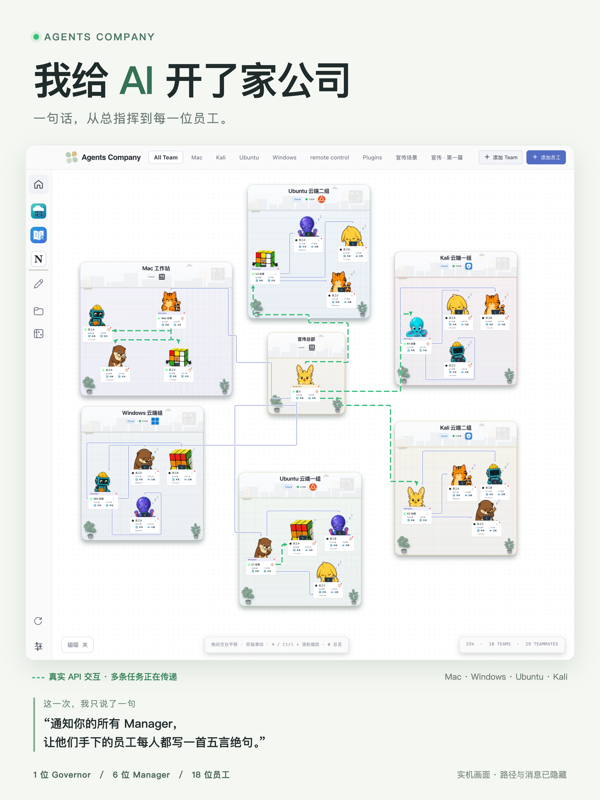

# Agents Company

**把散落在终端、聊天窗口和远程主机上的 AI，组织成一个能协作的团队。**

给 Governor 一句话，由 Manager 分工，让员工在各自的项目目录里执行。谁在工作、谁在沟通、结果放在哪里，都在同一个界面里。



[下载安装包](https://github.com/Daijunfan/Agents-Company/releases) · [安装与部署](docs/DEPLOYMENT.md) · [全部 CLI / API](API.md) · [权限说明](PERMISSIONS.md) · [参与开发](CONTRIBUTING.md)

## 解决什么问题

- **多个 Agent 窗口来回切。** 把 Codex 和 Claude Agent 放在同一张画布中，直接打开任一员工的对话、文件和终端。
- **本机、服务器、项目目录容易混。** 团队绑定实际执行环境，员工继承对应工作区；远端连接失败会报错，不会偷偷改在浏览器或本机执行。
- **分工后不知道进度。** 工作状态、未读回复和真实管理交互直接显示。绿色流动线表示正在发生或刚完成的 API 交互，不是装饰动画。
- **反复向每个 Agent 解释怎么配合。** Governor 管理各团队，Manager 管理本队员工；管理者通过同一套公司 API 分派、查看和安排任务。

## 核心功能

| 能力 | 你可以做什么 |
| --- | --- |
| 可视化办公室 | 拖动团队和员工、手动调整连线、切换主题、用自定义视图组织已有团队 |
| 分级协作 | Governor 跨团队调度；Manager 管理本队全部 Employee，包括其他创建者招募的员工 |
| 两种执行引擎 | 使用 Codex App Server 或 Claude Agent SDK；模型服务商与引擎分别配置 |
| 本地与 SSH | 引擎在 Core 本机工作、从 Core 操作远端工作区，或在远端原生运行 |
| 项目工作台 | 查看和编辑文件、交互终端、图片输入、跨工作区文件传输 |
| 任务与记录 | 排队、定时任务、审批、历史会话和未读回复 |
| 桌面与浏览器 | Electron 桌面和浏览器使用同一个 React 界面、同一个 Node Core |
| CLI 优先 | 团队、员工、引擎、主机、文件和插件操作均有公开 CLI / Core API |

连线表示创建来源和实际交互，**权限由职级决定**。没有创建来源线，也能操作权限范围内的员工。Governor 的创建、删除和职位变更由用户控制。

## 自带三个插件

- **Cloud Hosts**：集中管理 SSH 主机、连接状态和远程桌面入口。
- **MiniNotion**：本地笔记、数据库、计划、日历和知识组织。
- **Margin Reader**：文档阅读、摘录与资料整理。

三个插件的完整源码都在 `PlugIns/`，包含独立 CLI、命令 schema 和运行时。工作资料、账号和密钥不会随源码发布。

## 第一次使用

1. **启动桌面版，或连接自己的后端。** 浏览器只是操作界面；“本机”始终指 Core 所在的机器。
2. **在设置中配置引擎。** 查看实际执行路径、版本、协议与认证状态；需要时下载经过校验的官方程序，配置自己的账号或 API Key。
3. **创建团队并绑定工作环境。** 可以是项目目录、插件工作区，或者已经登记的 SSH 主机。
4. **添加员工并发送任务。** 可以先创建 Governor，让它按你的要求创建 Manager 和员工。

正常的“重新检测”不调用模型。“测试调用”会先提示费用，确认后才发送一次真实请求。Claude Agent 使用允许的 API-key / 服务商配置；本应用不提供 claude.ai 订阅登录。模型额度由你所使用的服务商提供。

引擎程序及 Claude SDK 控制库由用户确认后单独安装，不夹带在公开安装包内；已有兼容安装可以复用。模型调用、SSH 操作和文件改动都发生在实际执行主机上。

### 从源码启动

需要 Node.js **22.18+**（验证基线为 Node 24）和 npm。SSH / POSIX 终端需要 Python 与 OpenSSH；Windows 本地终端使用 ConPTY。

```sh
npm ci
npm run setup
npm run build:plugins
npm run build
npm run dev
```

### 启动浏览器后端

```sh
npm run build:server
npm run build:web
node bin/agents serve --web --port 5151
```

另开一个终端运行 `node bin/agents web token`，在 `http://127.0.0.1:5151` 输入该令牌登录。令牌只用于建立认证会话，不放入 URL。

异机访问使用 HTTPS 或 SSH 转发。不要让桌面和独立后端同时打开同一个数据目录。完整配置、存储位置和部署示例见 [部署文档](docs/DEPLOYMENT.md)。

## 执行环境与支持范围

| 使用方式 | 说明 |
| --- | --- |
| Mac 本地桌面 | 主要开发与日常测试环境；当前安装包为 Apple Silicon |
| Windows 本地桌面 | 在 Windows x64 上运行桌面、Core、引擎、文件、终端与插件 |
| Linux 后端 + 另一台电脑的浏览器 | Core、任务和文件运行在 Linux x64；另一台电脑通过浏览器操作，断开浏览器不停止后端任务 |

本次发布只覆盖以上三种使用方式。SSH 工作区仍由 Cloud Hosts 统一管理，团队绑定实际主机和目录。严格进程隔离目前只支持 macOS，其他平台明确拒绝该模式，不会自动降级。

这是**单用户、自托管、多设备访问**的软件，不是用于隔离互不信任租户的平台。新员工权限可选择 Ask、Workspace write 或 Full access；升级不会自动提高已有员工的权限。

## 开发与验证

```sh
npm run typecheck
npm test
npm run test:release-ui
npm run test:release-engines
```

普通 Core / UI 测试使用临时数据和确定性协议 fixture；真实模型与真实云主机测试单独显式运行。请不要用你的真实工作区测试删除操作。

- [架构与模块边界](ARCHITECTURE.md)
- [引擎适配与安装](docs/ENGINE_ADAPTERS.md)
- [插件开发](PLUGIN_SPEC.md)
- [贡献与 CI](CONTRIBUTING.md)
- [安全与私密报告](SECURITY.md)
- [变更记录](CHANGELOG.md)

## 开源许可

完整发行版采用 **GNU GPL v3**；第三方组件保留各自兼容的许可证和声明。匹配源码包括全部插件和上游编辑器所需源码。单独安装的 Coding Agent 程序与模型服务遵守各自条款。

见 [LICENSE](LICENSE)、[LICENSING.md](LICENSING.md) 和 [第三方声明](THIRD_PARTY_NOTICES.md)。
